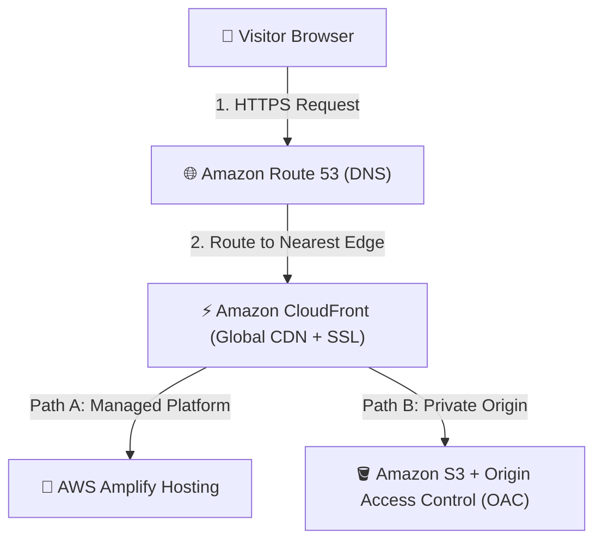

# AWS Cloud Developer Portfolio

A sleek, responsive, and high-performance developer portfolio website designed to be built and deployed on **AWS in 10 minutes or less**. This project is adapted from the AWS Builder Center guide (*"Ship a portfolio website in 10 minutes or less"*), tailored specifically for **Antigravity IDE** and the **AWS MCP (Model Context Protocol) Suite**.

> 📖 **Looking for architectural notes & learning guides?** Check the [Learning Guides (`docs/`)](file:///Users/shivendrag/Downloads/My%20Projects/my-portfolio/docs/) for in-depth explanations on AWS hosting options, CloudFront OAC security, and Antigravity tooling.

---

## Quick Navigation
- [1. High-Level Architecture Overview](#1-high-level-architecture-overview)
- [Prerequisites](#prerequisites)
- [Project Structure](#project-structure)
- [Local Development](#local-development--port-configuration)
- [Deployment Options](#deployment-options)
  - [Option A: AWS Amplify Hosting (Recommended / 10 Minutes)](#option-a-aws-amplify-hosting-recommended)
  - [Option B: Amazon S3 + CloudFront CDN](#option-b-amazon-s3--cloudfront-cdn)
- [Useful Commands](#useful-commands)
- [Learning Guides (`docs/`)](#learning-guides-docs)

---

## 1. High-Level Architecture Overview

Whether deploying via **AWS Amplify Hosting** (managed zero-config) or **Amazon S3 + CloudFront** (enterprise composable infrastructure), global visitors receive low-latency cached content served securely over HTTPS:



| Layer | AWS Service | Purpose |
| :--- | :--- | :--- |
| **DNS** | Amazon Route 53 | Resolves custom domain to global edge distribution |
| **Edge Cache & SSL** | Amazon CloudFront | Caches HTML/CSS/JS globally with automated TLS encryption |
| **Option A (Managed)** | AWS Amplify Hosting | Zero-config deployment directly from `portfolio.zip` |
| **Option B (IaaS)** | Amazon S3 + OAC | Private static bucket restricted strictly to CloudFront via SigV4 |

---

## Prerequisites

1. **AWS CLI (v2)** authenticated with your AWS account:
   ```bash
   aws sts get-caller-identity
   ```
2. **`uv` Package Manager** (only used for running the AWS MCP proxy):
   ```bash
   uv --version
   ```
3. **Any Local Static HTTP Server** (Node, Python, or IDE extension):
   > [!NOTE]
   > **Pure Frontend Project**: This project is 100% static HTML5, CSS3, and vanilla JavaScript. There is **no Python backend or runtime dependency**. The Python command below is simply an optional zero-install macOS utility to serve static files locally.

---

## Project Structure

```
my-portfolio/
├── assets/                              # Production static assets (resume PDF, images, etc.)
│   └── Shivendra_Gupta_Resume.pdf       # Downloadable resume
├── docs/                                # In-depth architectural & deployment guides
│   ├── 01-portfolio-architecture-and-aws-hosting.md # S3, CloudFront & Amplify hosting models
│   ├── 02-antigravity-and-aws-toolkit.md            # Antigravity IDE & AWS MCP proxy integration
│   ├── 03-deployment-and-ci-cd-guide.md             # Production shipping & domain configuration
│   └── 04-architectural-decisions-and-comparisons.md # ADRs, cost analysis, and comparisons
├── .agents/
│   └── mcp_config.json                  # AWS MCP proxy configuration for Antigravity
├── AGENTS.md                            # Guidelines for AI coding agents (< 50 lines)
├── README.md                            # Main project operational guide (this file)
├── index.html                           # Portfolio website markup
├── style.css                            # Modern styling & design system tokens
└── script.js                            # Interactive client-side logic
```

---

## Local Development & Port Configuration

Because modern browsers restrict certain local features (like CORS and ES modules) when opening raw `file:///` URLs, use any lightweight local web server to preview the site on **port 3000**:

```bash
# Option 1: Using Node.js (npx serve) — specify port with -l
npx serve . -l 3000

# Option 2: Using Node.js (http-server) — specify port with -p
npx http-server . -p 3000

# Option 3: Using Python's built-in static server (pre-installed on macOS)
# The port number is passed as the last argument:
python3 -m http.server 3000
```

Open **`http://localhost:3000`** in your browser to preview the site.

> [!TIP]
> **Changing the Port**: There is no hardcoded port configuration file in this repository. To run on a different port (e.g., 8080), simply replace `3000` with your desired port number in any of the commands above (e.g., `npx serve . -l 8080` or `python3 -m http.server 8080`).

---

## Deployment Options

### Option A: AWS Amplify Hosting (Active Live Deployment)

This is the active deployment method used for this project, inspired by the AWS Builder Center guide [*Ship a portfolio website in 10 minutes or less*](https://builder.aws.com/content/3BXiq6CzCWLJISy3LBK45t4iyRL/ship-a-portfolio-website-in-10-minutes-or-less).

> [!NOTE]
> **Active Deployment Details**:
> - **App Name**: `shivendra-portfolio`
> - **App ID**: `dcqzhih9h4pfm`
> - **Production URL**: [https://dcqzhih9h4pfm.amplifyapp.com](https://dcqzhih9h4pfm.amplifyapp.com)
> - **Manage via**: [AWS Amplify Console](https://console.aws.amazon.com/amplify) or `aws amplify list-apps`

#### 1. HTTPS by Default & Free Managed SSL Certificate
As highlighted in the AWS Builder Center guide:
* **Automatic HTTPS**: Every Amplify app comes out of the box with HTTPS enabled by default.
* **Free SSL Certificate**: AWS Amplify automatically provisions and manages an SSL/TLS certificate (via AWS Certificate Manager and Amazon CloudFront edge infrastructure).
* **Zero Maintenance**: Certificate renewal, DNS validation, and TLS termination are handled completely automatically with zero ongoing maintenance or renewal fees.

#### 2. Behind the Scenes: Where are S3 and CloudFront?
* **Managed PaaS Model**: AWS Amplify Hosting is a fully managed platform. Under the hood, Amplify utilizes internal Amazon S3 storage for holding your web artifacts and Amazon CloudFront edge locations for global low-latency CDN delivery.
* **Console Visibility**: Because AWS manages these underlying infrastructure components within the Amplify service boundary, you will **not** see an explicit S3 bucket or CloudFront distribution created in your standalone S3 (`aws s3 ls`) or CloudFront (`aws cloudfront list-distributions`) consoles. All deployments, caching, and domain configurations are managed centrally inside the AWS Amplify Console.
* *(Note: If you want direct, granular ownership of standalone S3 buckets and CloudFront distribution IDs, see [Option B: Amazon S3 + CloudFront CDN](#option-b-amazon-s3--cloudfront-cdn) below).*

#### 3. Create Archive with Assets & Deploy

1. **Create the Production ZIP Archive**:
   ```bash
   zip -r portfolio.zip index.html style.css script.js assets/
   ```
   **Command Breakdown**:
   - `zip`: Standard CLI utility used to compress files into `.zip` format.
   - `-r` (*recursive*): Recursively traverses and packages all subdirectories and nested files inside `assets/`.
   - `portfolio.zip`: Output deployment archive.
   - `index.html style.css script.js assets/`: The precise whitelist of production files to deploy. Bundling `assets/` ensures your PDF resume (`assets/Shivendra_Gupta_Resume.pdf`) and any future images/favicons are included and accessible on the live site, while keeping internal files (`.git/`, `.agents/`, `docs/`, `README.md`) out of production.

2. **Deploy via AWS Amplify Console**:
   - Open the [AWS Amplify Console](https://console.aws.amazon.com/amplify).
   - Select your existing app (`shivendra-portfolio`) or **Deploy without Git**, drag and drop `portfolio.zip`, and click **Save and Deploy**.
   - Your site and downloadable resume are live immediately with global edge caching and HTTPS.

### Option B: Amazon S3 + CloudFront CDN

For enterprise-grade infrastructure with full control:

1. **Sync to S3 Bucket**:
   ```bash
   aws s3 sync . s3://<your-portfolio-bucket-name>/ \
     --exclude ".git/*" \
     --exclude ".agents/*" \
     --exclude "docs/*" \
     --exclude "*.md" \
     --delete
   ```
2. **Invalidate CloudFront Edge Cache**:
   ```bash
   aws cloudfront create-invalidation \
     --distribution-id <YOUR_DISTRIBUTION_ID> \
     --paths "/*"
   ```

---

## Useful Commands

| Command | Purpose |
| :--- | :--- |
| `python3 -m http.server 3000` | Start local development server |
| `aws sts get-caller-identity` | Verify active AWS credentials |
| `aws amplify list-apps` | List deployed AWS Amplify applications |
| `aws s3 sync . s3://<bucket>` | Sync static files to private S3 bucket |
| `aws cloudfront list-distributions` | Inspect CloudFront CDN edge distributions |

---

## Learning Guides (`docs/`)

Explore the detailed architecture guides in [`docs/`](file:///Users/shivendrag/Downloads/My%20Projects/my-portfolio/docs/):
- [01 - Portfolio Architecture & AWS Hosting](file:///Users/shivendrag/Downloads/My%20Projects/my-portfolio/docs/01-portfolio-architecture-and-aws-hosting.md)
- [02 - Antigravity IDE & AWS Toolkit](file:///Users/shivendrag/Downloads/My%20Projects/my-portfolio/docs/02-antigravity-and-aws-toolkit.md)
- [03 - Deployment & CI/CD Guide](file:///Users/shivendrag/Downloads/My%20Projects/my-portfolio/docs/03-deployment-and-ci-cd-guide.md)
- [04 - Architectural Decisions & Comparisons](file:///Users/shivendrag/Downloads/My%20Projects/my-portfolio/docs/04-architectural-decisions-and-comparisons.md)
