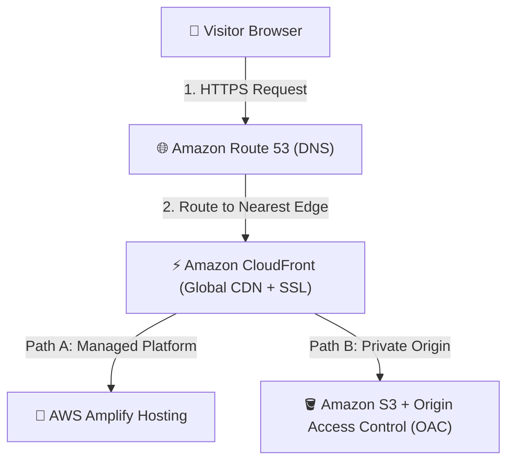

# 01 - Portfolio Architecture & AWS Hosting

This guide outlines the architecture of hosting a modern static portfolio website on AWS, contrasting the managed serverless hosting path (**AWS Amplify Hosting**) with the enterprise infrastructure-as-code path (**Amazon S3 + Amazon CloudFront**).

---

## 1. High-Level Architecture Overview

A static portfolio website comprises HTML, CSS, JavaScript, fonts, and images. Serving these files reliably and securely to global visitors requires edge caching, TLS/SSL certificates, and low-latency storage:



| Layer | AWS Service | Purpose |
| :--- | :--- | :--- |
| **DNS** | Amazon Route 53 | Resolves custom domain to global edge distribution |
| **Edge Cache & SSL** | Amazon CloudFront | Caches HTML/CSS/JS globally with automated TLS encryption |
| **Option A (Managed)** | AWS Amplify Hosting | Zero-config deployment directly from `portfolio.zip` |
| **Option B (IaaS)** | Amazon S3 + OAC | Private static bucket restricted strictly to CloudFront via SigV4 |

---

## 2. AWS Hosting Models: S3 + CloudFront vs. AWS Amplify

| Architectural Dimension | AWS Amplify Hosting | Amazon S3 + Amazon CloudFront |
| :--- | :--- | :--- |
| **Primary Philosophy** | Managed Developer Platform (PaaS) | Composable Cloud Infrastructure (IaaS) |
| **Setup Time** | < 5 minutes (Instant live URL) | 10–15 minutes (Bucket, OAC, CloudFront, ACM) |
| **Origin Storage** | Fully managed internal S3 storage | Explicit Amazon S3 Bucket |
| **Content Delivery** | Built-in CloudFront CDN distribution | Dedicated Amazon CloudFront Distribution |
| **SSL/TLS Certificates** | Automated free managed certificate | Free via AWS Certificate Manager (us-east-1) |
| **Continuous Deployment** | Native Git-based CI/CD (GitHub, GitLab) | GitHub Actions, AWS CodePipeline, or AWS CLI |
| **Preview Environments** | Automatic pull request preview branches | Requires multi-bucket or path-based CDK routing |
| **Best Used For** | Fast portfolio launches, frontends, Jamstack | Enterprise control, strict IAM isolation, CDK IaC |

---

## 3. Deep Dive: AWS Amplify Hosting (The 10-Minute Path)

As recommended in the AWS Builder Center guide *"Ship a portfolio website in 10 minutes or less"*, **AWS Amplify Hosting** provides the fastest route from code to production:

### How It Works Under the Hood
1. **Source Code Ingestion**: Amplify accepts code either via Git repository connection or via direct ZIP/directory upload through the AWS CLI or Amplify Console.
2. **Hosting Infrastructure**: Amplify provisions a globally distributed CDN with DDoS protection, HTTP/2 and HTTP/3 support, and automated cache management.
3. **Custom Domains & SSL**: Amplify provisions and renews managed SSL/TLS certificates automatically when you attach a custom domain.
4. **Instant Rollbacks**: Every deployment creates an immutable build artifact, enabling one-click instant rollbacks in the AWS Console.

---

## 4. Deep Dive: Amazon S3 + CloudFront with Origin Access Control (OAC)

For developers who prefer granular infrastructure ownership:

### Why S3 Static Website Hosting Alone is Outdated
Historically, developers enabled "Static Website Hosting" on S3 buckets. However, this approach:
- Required making the S3 bucket **publicly readable to the entire internet**.
- Did **not support native HTTPS** on custom domains (HTTP only).
- Excluded modern caching, compression, and edge security.

### The Modern Standard: Private S3 + CloudFront + OAC
1. **Bucket Privacy**: The S3 bucket has **Block Public Access enabled (100% private)**.
2. **Origin Access Control (OAC)**: CloudFront signs requests to S3 using SigV4 credentials. S3 only permits reads from the specific CloudFront Distribution ARN:
   ```json
   {
     "Version": "2012-10-17",
     "Statement": {
       "Sid": "AllowCloudFrontServicePrincipalReadOnly",
       "Effect": "Allow",
       "Principal": {
         "Service": "cloudfront.amazonaws.com"
       },
       "Action": "s3:GetObject",
       "Resource": "arn:aws:s3:::my-portfolio-bucket/*",
       "Condition": {
         "StringEquals": {
           "AWS:SourceArn": "arn:aws:cloudfront::828547077891:distribution/EDFDVBD6EXAMPLE"
         }
       }
     }
   }
   ```
3. **Global Edge Performance**: CloudFront caches static assets across hundreds of global Point of Presence (PoP) locations, ensuring sub-50ms page loads worldwide.
